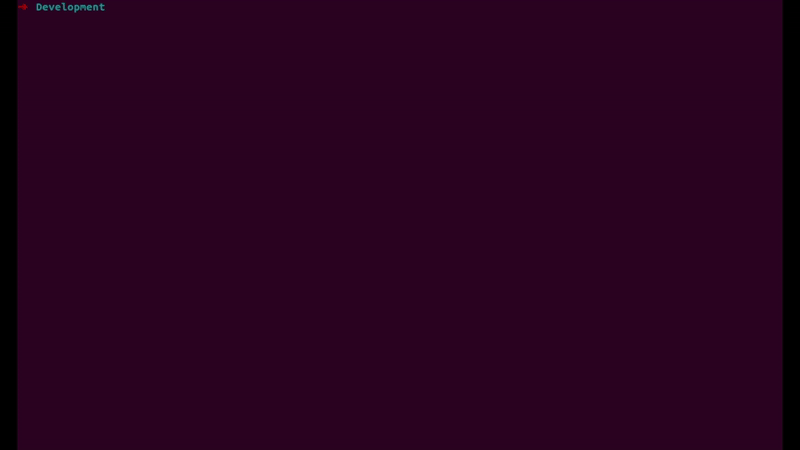

# Open SAAS

### Create fully bundled SaaS application (Backend & Frontend) using an interactive CLI.

<br />

### [Link to Dashboard](https://frontegg.github.io/opensaas)

<br />

## What's in it (WIIFM)?
### UI elements
The application comes bundled with fully enabled dashboard including UI elements based on bootstrap and Material UI.<br />

### Dashboard and charts
The application is bundled with re-charts which include a fully enabled dashboard with charts (line, donut, pie) and data hooks which loads the data from the backend directly<br/>

### Frontend
The frontend is based on [React](https://reactjs.org/) including [Apollo client](https://www.apollographql.com/docs/react/) for the GraphQL operations <br/>

### Backend 
Backend is bundled with 2 micro-services and API gateway implemented in [Node.JS](https://nodejs.org/en/) over [Typescript](https://www.typescriptlang.org/) including full support for [GraphQL](https://graphql.org/) data query.
<br/>

#### Micro-services
Micro-services are bundled with samples for data handling on [PostgreSQL](https://www.postgresql.org/) and [MongoDB](https://www.mongodb.com/). <br/>
(*) In order to run the backend fully [Docker](https://www.docker.com/) is required.<br/> <br/>
### E2E enterprise features (already plugged in)
In additions, it has plugged in [Frontegg](https://frontegg.com) powered enterprise features **FULLY MANAGED** including:
- Identity management (Login, Forgot password)
- Authorization management (Roles and permissions handling)
- Team management (inviting new users and revoking access)
- Profile component including MFA and password change
- Tenants management including back-office
- Full enabled notifications center including:
  - Notifications bell
  - Web push support
  - Webhooks infrastructure (including UI component allowing tenants to subscribe to webhooks)
  - Slack Infrastructure (including UI component allowing tenants to subscribe to slack events)
- Reporting mechanism
  - Send weekly digest to customers
  - Host customers reports on an in-app component allowing customers to schedule their own reports and view current status

<br />

## Quick Start
<br />

```sh
npx opensaas my-app --client-id=MY_CLIENT_ID --api-key=MY_API_KEY
cd my-app
npm run start
```

<br />

(?) The Frontegg clientId and api key are available upon registration with [Frontegg](https://portal.frontegg.com) via the [Administration](https://portal.frontegg.com/administration) menu

<br />

<p align='center'>

</p>

### Port bindings

<br />

Api gateway default port is <b>5000</b>.

Metrics service default port is <b>5001</b>.

Config service default port is <b>5002</b>.

The dashboard can be opened on http://localhost:3000/.

Dashboard BFF is running on http://localhost:8080/.

<br />

## Project structure

<br />

```
my-app
├── README.md
├── node_modules
├── package.json
├── .gitignore
├── frontend
│   ├── Dockerfile
│   ├── node_modules
│   ├── package.json
│   ├── .gitignore
│   ├── README.md
│   ├── src
│   |    └── Componentes
│   |          └── *
│   |    └── Pages
│   |          └── *
│   |    └── *
│   └── public
│        └── *
└── backend
    └── api-gw
    │   ├── README.md
    │   ├── node_modules
    │   ├── package.json
    │   └── src
    |       ├── server.ts
    |       ├── autenticated-data-source.ts
    |       └── lib
    |            └── config.ts
    └── services
        └── config-service
        |   ├── README.md
        |   ├── node_modules
        |   ├── package.json
        |   └── src
        |       ├── server.ts
        |       ├── db.ts
        |       ├── graphql
        |       |    └── *
        |       ├── models
        |       |    └── *
        |       └── lib
        |            └── *
        └── metrics-service
                ├── README.md
                ├── node_modules
                ├── package.json
                └── src
                    ├── server.ts
                    ├── db
                    |    └── *
                    ├── dto
                    |    └── *
                    ├── helpers
                    |    └── *
                    ├── lib
                    |    └── *
                    └── resolvers
                         └── *

```

<br />

<br />

## CLI

<br />

#### Add new service

`npm run cli add service-name`

#### Remove service

`npm run cli remove service-name`

#### Run application

`npm run cli run`

#### Init project

`npm run cli init`

<br />

## Example of requests to backend using GraphQL

<br />

    curl \
      -X POST \
      -H "Content-Type: application/json" \
      --data '{ "query": "{ features { name, id, tenantId } }" }' \
      http://localhost:5000/graphql

    curl \
      -X POST \
      -H "Content-Type: application/json" \
      --data '{ "query": "{ requests { url } }" }' \
      http://localhost:5000/graphql

<br />

### License

[](https://opensource.org/licenses/MIT)
